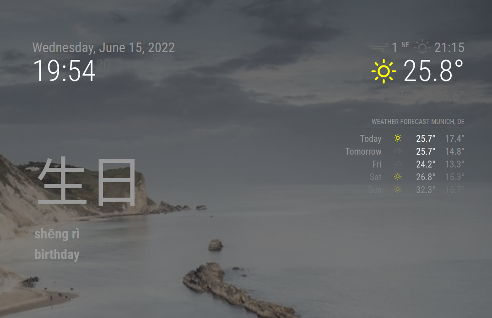

# Magic Mirror² Hanzi

This is a [`Magic Mirror²`](https://magicmirror.builders/) module that rotates between Chinese characters (hanzi), their pronunciation (in pinyin)
and the translation in English.
Every Chinese Mandarin language learner will appreciate this learning tool.

Magic Mirror² is open source software for creating a powerful dashboard mostly for home use.

`Magic Mirror² Hanzi` is based on the [Chinese Mandarin HSK](https://en.wikipedia.org/wiki/Hanyu_Shuiping_Kaoshi) test vocabulary and you can configure up to 6 levels
of difficulty.

The interval of the rotation of the characters is also configurable.

## Preview Screenshot

This is how Magic Mirror² Hanzi looks in my configuration:



## Installation

Clone this repository into your MagicMirror `modules` folder.

Example:

```
cd /home/pi/MagicMirror/modules
git clone https://github.com/tderflinger/MMM-Hanzi.git
```

Edit your configuration file under `config/config.js` with the following configuration.
```
{
  module: "MMM-Hanzi",
  position: "top_left",
  config: {
      hskLevel: 2, // up to six levels available
      interval: 300000 // rotation speed in ms
  },
},
```

## Config Options
| **Option**        | **Description** |
| --- | --- |
| `hskLevel`     | HSK difficulty level, number from 1 to 6 |
| `interval`      | Rotation time of Hanzi in ms |

## References

Magic Mirror²: https://magicmirror.builders

HSK: https://en.wikipedia.org/wiki/Hanyu_Shuiping_Kaoshi

Source of HSK Hanzi Vocabulary Files: https://github.com/clem109/hsk-vocabulary

## License

MIT License